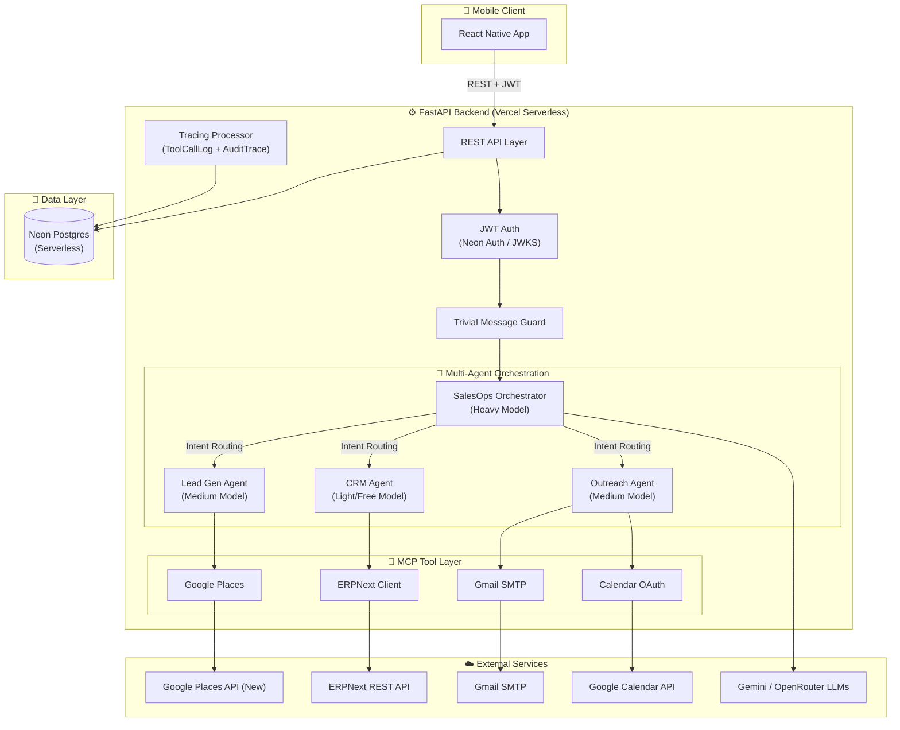
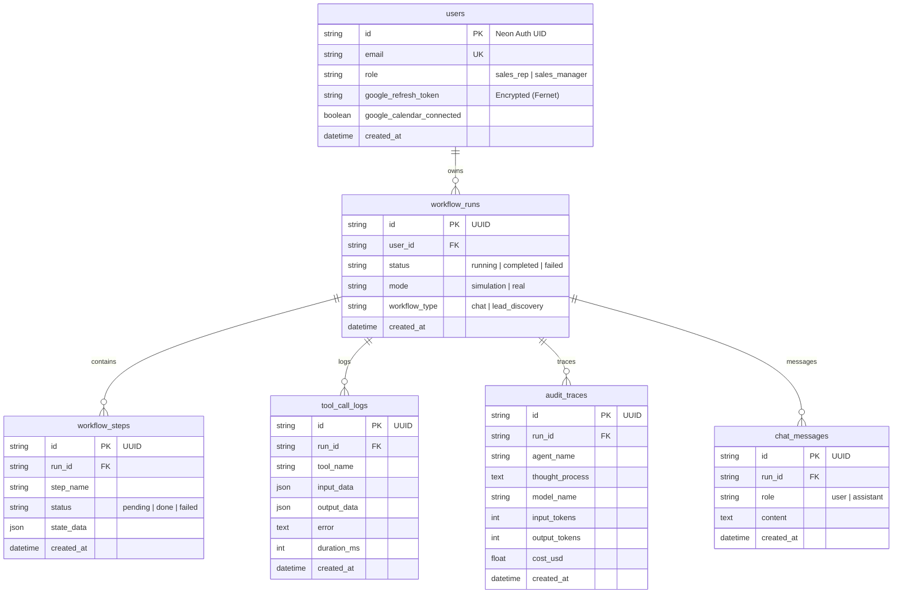

<div align="center">

# 🤖 Salesops — AI-Powered Sales Operations Agent

**Autonomous Content-to-Action Agent for Lead Discovery, CRM Management & Outreach**

[](https://python.org)
[](https://fastapi.tiangolo.com)
[](https://reactnative.dev)
[](https://neon.tech)
[](https://vercel.com)
[](https://github.com/openai/openai-agents-python)

</div>

---

## 📑 Table of Contents

- [Overview](#overview)
- [Architecture](#architecture)
- [Data Schemas](#data-schemas)
- [Tools & APIs](#tools--apis)
- [Antigravity's Role](#antigravitys-role)
- [Setup & Installation](#setup--installation)
- [Assumptions](#assumptions)
- [Privacy & Security](#privacy--security)
- [Cost & Latency Analysis](#cost--latency-analysis)
- [Scalability](#scalability)
- [Baseline Comparison](#baseline-comparison)
- [Known Limitations](#known-limitations)

---

## Overview

**Salesops** is a multi-agent AI system that acts as an autonomous sales operations assistant. It accepts natural language instructions (in English, Urdu, or Roman Urdu) and routes them to specialized sub-agents — each responsible for a distinct sales workflow — eliminating the manual, repetitive tasks that slow down sales teams.

The system intelligently coordinates between:

- **Google Places API** — for real-time lead discovery and enrichment
- **ERPNext CRM** — for pipeline management, lead creation, and tracking
- **Google Workspace** (Gmail & Calendar) — for personalized outreach and scheduling
- **Neon Postgres** — for persistent state, tracing, and chat history

### Monorepo Structure

```text
AISeekho-challenge/
├── salesops-agent-backend/          # ⚙️ FastAPI + OpenAI Agents SDK backend
│   ├── agent_core/                  #   AI orchestration engine
│   │   ├── orchestrator.py          #     Multi-agent router + intent detection
│   │   └── tracing.py               #     Workflow tracing → DB persistence
│   ├── api/endpoints/               #   FastAPI route handlers
│   │   ├── chat.py                  #     Chat endpoint (simple + structured)
│   │   ├── dashboard.py             #     Analytics, metrics, paginated leads
│   │   ├── runs.py / logs.py        #     Run history & trace logs
│   │   ├── calendar.py              #     Calendar connect & availability
│   │   └── pages.py                 #     Landing, Privacy, Terms pages
│   ├── core/                        #   Config (Pydantic Settings) & JWT auth
│   ├── db/                          #   SQLAlchemy models & async session
│   ├── mcp_tools/                   #   Tool adapters (ERPNext, Places, Gmail, Calendar)
│   ├── alembic/                     #   Database migrations
│   ├── main.py                      #   FastAPI entry point
│   └── vercel.json                  #   Vercel serverless config
│
├── salesopsapp/                     # 📱 React Native mobile frontend
│   ├── src/
│   │   ├── screens/                 #   App screens
│   │   │   ├── LoginScreen.tsx      #     Auth login (Neon Auth)
│   │   │   ├── RegisterScreen.tsx   #     Auth registration
│   │   │   ├── HomeScreen.tsx       #     Dashboard home with metrics
│   │   │   ├── ChatScreen.tsx       #     AI agent chat interface
│   │   │   ├── CRMLeadsScreen.tsx   #     ERPNext leads browser
│   │   │   ├── DiscoveryScreen.tsx  #     Lead discovery search
│   │   │   ├── OutcomeDashboardScreen.tsx  # Before/after metrics
│   │   │   ├── TraceLogsScreen.tsx  #     Agent trace log viewer
│   │   │   ├── SimulationConsoleScreen.tsx # Sim vs real toggle
│   │   │   ├── AccountScreen.tsx    #     Profile & Calendar connect
│   │   │   └── NotificationScreen.tsx
│   │   ├── components/              #   Reusable UI components
│   │   │   ├── AuroraGradient.tsx   #     Aurora background effect
│   │   │   ├── GlassCard.tsx        #     Glassmorphism card
│   │   │   ├── MetricCard.tsx       #     Dashboard metric tiles
│   │   │   ├── NeonButton.tsx       #     Gradient CTA buttons
│   │   │   ├── WorkflowTimeline.tsx #     Agent step visualizer
│   │   │   └── ...                  #     AuthInput, PlaybookCard, etc.
│   │   ├── services/                #   API clients
│   │   │   ├── httpClient.ts        #     Axios instance + JWT interceptor
│   │   │   ├── authService.ts       #     Neon Auth login/register
│   │   │   ├── agentApi.ts          #     Chat & stream endpoints
│   │   │   ├── dashboardApi.ts      #     Dashboard stats fetching
│   │   │   └── calendarApi.ts       #     Calendar connection
│   │   ├── store/                   #   Redux Toolkit state
│   │   │   └── slices/              #     authSlice, themeSlice, workflowSlice
│   │   ├── navigation/              #   React Navigation (stack + bottom tabs)
│   │   ├── theme.ts                 #   Aurora dark/light design tokens
│   │   └── config.ts                #   API base URL config
│   └── package.json
│
├── DOCs/                            # 📄 Architecture plans & documentation
└── README.md                        # ← You are here
```

---

## Architecture

### High-Level System Architecture



### Agent Routing Strategy

| Agent | Model Tier | Provider | Responsibility |
|-------|-----------|----------|---------------|
| **SalesOpsOrchestrator** | Heavy | Gemini 2.5 Pro | Intent classification, multi-step planning, delegation |
| **LeadGenAgent** | Medium | Gemini 2.5 Flash | Google Places search, lead enrichment, opportunity scoring |
| **CRMAgent** | Light/Free | OpenRouter GLM-4.5 | ERPNext CRUD, pipeline analysis |
| **OutreachAgent** | Medium | Gemini 2.5 Flash | Email drafting, calendar scheduling |

### Request Flow

1. **Client** sends `POST /api/chat/stream` with JWT + message history
2. **Auth middleware** validates JWT via Neon Auth JWKS endpoint
3. **Trivial guard** short-circuits greetings on first message (saves LLM tokens)
4. **Orchestrator** classifies intent and delegates to the appropriate sub-agent
5. **Sub-agent** invokes MCP tools (Google Places, ERPNext, Gmail, Calendar)
6. **Tracing processor** queues `ToolCallLog` and `AuditTrace` rows
7. **Response** returns structured JSON with steps + final message
8. **Flush** persists all queued DB writes before the serverless function exits

---

## Data Schemas

### Database ERD



### Key Pydantic Schemas (Tool Inputs)

| Tool | Input Schema | Key Fields |
|------|-------------|------------|
| `search_leads_multi` | `SearchLeadsMultiInput` | `industry`, `location`, `max_results_per_query` |
| `search_businesses` | `SearchBusinessesInput` | `query`, `max_results` |
| `create_erpnext_lead` | `CreateLeadInput` | `first_name`, `mobile_no`, `email_id` |
| `analyze_crm_data` | `AnalyzeCrmInput` | `doctype`, `filters`, `fields`, `limit`, `limit_start`, `order_by` |
| `send_email` | Function args | `to_email`, `subject`, `body` |
| `check_availability` | `CheckAvailabilityInput` | `date`, `timezone` |
| `create_event` | `CreateEventInput` | `summary`, `start_datetime`, `end_datetime`, `attendee_emails` |

---

## Tools & APIs

### MCP Tool Inventory

| Tool | External API | Protocol | Purpose |
|------|-------------|----------|---------|
| `search_leads_multi` | Google Places (New) | HTTPS POST | Multi-query parallel lead discovery with dedup |
| `search_businesses` | Google Places (New) | HTTPS POST | Single-query business search |
| `get_place_details` | Google Places (New) | HTTPS GET | Detailed place enrichment (phone, website, hours) |
| `create_erpnext_lead` | ERPNext REST | HTTPS POST | Create CRM lead record |
| `read_erpnext_lead` | ERPNext REST | HTTPS GET | Fetch lead details by ID |
| `update_erpnext_lead` | ERPNext REST | HTTPS PUT | Update lead status/fields |
| `analyze_crm_data` | ERPNext REST | HTTPS GET | Paginated pipeline analytics |
| `get_chatbot_link` | ERPNext REST | HTTPS GET | Fetch quotation/chatbot link |
| `send_email` | Gmail SMTP | SMTP/TLS | Send personalized outreach emails |
| `check_availability` | Google Calendar | HTTPS POST (FreeBusy) | Check calendar availability |
| `create_event` | Google Calendar | HTTPS POST | Schedule meetings with attendees |

### Industry Synonym Expansion

The `search_leads_multi` tool automatically expands broad industry keywords into 3–4 specific search variations for maximum coverage:

```
"healthcare" → ["clinics", "hospitals", "diagnostic labs", "medical centers"]
"textile"    → ["textile mills", "fabric manufacturers", "garment factories", "clothing exporters"]
"tech"       → ["software companies", "IT services", "technology startups", "web development agencies"]
```

All queries run **concurrently** via `asyncio.gather` and results are **deduplicated** by `place_id`.

---

## Antigravity's Role

**Antigravity** (Google DeepMind's AI coding assistant) served as the primary development partner throughout this project, building **both the backend and the mobile frontend** end-to-end. Its contributions include:

### Backend Contributions

| Phase | Contribution |
|-------|-------------|
| **Architecture** | Designed the multi-agent orchestration pattern with tiered model routing |
| **FastAPI Backend** | Implemented all endpoints (chat, dashboard, runs, logs, calendar, pages), middleware, and error handling |
| **Agent System** | Built the OpenAI Agents SDK integration with function tools, sub-agent delegation, and context-aware prompts |
| **MCP Tools** | Developed all tool adapters: Google Places (multi-query parallel search), ERPNext CRUD, Gmail SMTP, Calendar OAuth |
| **Tracing** | Created the `DatabaseTracingProcessor` that queues async DB writes for serverless compatibility |
| **Database** | Designed all SQLAlchemy models, Alembic migrations, and async session management |
| **Security** | Implemented JWT/JWKS auth via Neon Auth, Fernet token encryption, correlation-ID error handling |
| **Optimization** | Added trivial message guard, paginated lead fetching, and tiered model cost optimization |
| **Compliance** | Built OAuth-compliant public pages (landing, privacy, terms) and Google site verification |

### Frontend (Mobile App) Contributions

| Phase | Contribution |
|-------|-------------|
| **App Architecture** | Set up React Native 0.85 project with TypeScript, React Navigation (stack + bottom tabs), and Redux Toolkit |
| **Design System** | Created the "Aurora Intelligence" theme (`theme.ts`) with dark/light mode palettes, aurora gradients, glassmorphism tokens, and consistent spacing/radius scales |
| **Auth Screens** | Built `LoginScreen` and `RegisterScreen` with Neon Auth integration, secure token persistence via `react-native-keychain`, and JWT auto-refresh interceptor |
| **Dashboard** | Developed `HomeScreen` with animated metric cards, recent activity feed, quick-action chips, and playbook suggestions |
| **Chat Interface** | Implemented `ChatScreen` with agent step visualization (`WorkflowTimeline`), typewriter-style message rendering, and structured response handling |
| **CRM & Discovery** | Built `CRMLeadsScreen` for paginated ERPNext lead browsing and `DiscoveryScreen` for lead search |
| **Outcome Dashboard** | Created `OutcomeDashboardScreen` showing before/after pipeline metrics |
| **Trace Logs** | Built `TraceLogsScreen` to render agent reasoning chains, tool calls, and cost breakdowns |
| **Account & Calendar** | Developed `AccountScreen` with Google Calendar OAuth connection flow and encrypted token storage |
| **UI Components** | Created reusable components: `AuroraGradient`, `GlassCard`, `MetricCard`, `NeonButton`, `AuthInput`, `PlaybookCard`, `QuickActionChip`, `RecentActivity`, `WorkflowTimeline` |
| **API Layer** | Built typed API services (`httpClient.ts`, `agentApi.ts`, `authService.ts`, `dashboardApi.ts`, `calendarApi.ts`) with Axios interceptors for JWT management |
| **State Management** | Implemented Redux slices: `authSlice` (user session), `themeSlice` (dark/light toggle), `workflowSlice` (run tracking) |

---

## Setup & Installation

### Prerequisites

- **Python 3.13+** and **pip** (or [uv](https://docs.astral.sh/uv/))
- **Node.js 18+** and **npm** (for React Native frontend)
- A **Neon Postgres** database ([free tier](https://neon.tech))
- API keys: Google Places, Gemini, ERPNext token, Gmail App Password

### Backend Setup

```bash
cd salesops-agent-backend

# Create virtual environment
python -m venv .venv
.venv\Scripts\activate        # Windows
# source .venv/bin/activate   # macOS/Linux

# Install dependencies
pip install -r requirements.txt

# Configure environment
cp .env.example .env
# Edit .env with your credentials (see .env.example for all variables)

# Run database migrations
alembic upgrade head

# Start dev server
uvicorn main:app --reload
# → http://localhost:8000/docs
```

### Mobile App Setup

```bash
cd salesopsapp
npm install
npx react-native run-android   # or run-ios
```

### Required Environment Variables

| Variable | Description |
|----------|-------------|
| `DATABASE_URL` | Neon Postgres connection string (`postgresql+asyncpg://...`) |
| `ERPNEXT_BASE_URL` | ERPNext instance URL |
| `ERPNEXT_API_TOKEN` | ERPNext API `key:secret` pair |
| `GOOGLE_PLACES_API_KEY` | Google Places API (New) key |
| `GEMINI_API_KEY` | Gemini API key |
| `OPENROUTER_API_KEY` | OpenRouter key (optional, falls back to Gemini) |
| `GMAIL_USER` / `GMAIL_APP_PASSWORD` | Gmail SMTP credentials |
| `GOOGLE_CALENDAR_CLIENT_ID` / `CLIENT_SECRET` | Google OAuth credentials |
| `ENCRYPTION_KEY` | Fernet key for token encryption |
| `NEON_AUTH_URL` / `NEON_AUTH_JWKS_URL` | Neon Auth endpoints |

---

## Assumptions

1. **ERPNext availability** — The ERPNext CRM instance is accessible via its REST API with a valid API token.
2. **Google API quotas** — Google Places and Calendar APIs have sufficient quota for the expected usage volume.
3. **Single-tenant** — The current deployment assumes a single organization. Multi-tenancy would require schema isolation.
4. **Vercel buffering** — True SSE streaming is not possible on Vercel's Python runtime; we collect all events and return structured JSON.
5. **Gmail App Password** — Users must generate a Gmail App Password (not their account password) for SMTP access.
6. **Calendar OAuth** — Users must complete the OAuth flow once to connect their Google Calendar. The refresh token is stored encrypted in the database.
7. **LLM availability** — At least one LLM provider (Gemini or OpenRouter) must be reachable. The system gracefully falls back from OpenRouter to Gemini if needed.

---

## Privacy & Security

### Data Handling

- **No data sold or shared** — User data is used solely for providing the SalesOps service.
- **Encrypted storage** — Google Calendar refresh tokens are encrypted at rest using Fernet (AES-128-CBC).
- **JWT authentication** — All API endpoints (except public pages) require a valid JWT issued by Neon Auth, verified via JWKS (EdDSA/Ed25519).
- **Correlation-ID errors** — Internal errors are never leaked to clients; only a generic message + error ID is returned.
- **No PII in logs** — Structured logging excludes sensitive user data.

### OAuth Scopes

| Scope | Purpose | Access Level |
|-------|---------|-------------|
| Gmail (SMTP) | Send outreach emails on user's behalf | Send-only (App Password) |
| Google Calendar | Check availability & schedule meetings | Read/Write (OAuth refresh token) |
| Google Places | Search public business directories | Read-only (API key) |

### Compliance

- Public `/privacy` and `/terms` pages served at the backend root
- Google OAuth consent screen compliance (app name, purpose, policy links)
- Automated Google Search Console ownership verification via dynamic HTML file handler

---

## Cost & Latency Analysis

### LLM Cost Estimates (per request)

| Model | Role | Input Cost | Output Cost | Est. per Request |
|-------|------|-----------|------------|-----------------|
| Gemini 2.5 Pro | Orchestrator | $1.25/1M tokens | $10.00/1M tokens | ~$0.005–0.02 |
| Gemini 2.5 Flash | Lead Gen, Outreach | $0.15/1M tokens | $0.60/1M tokens | ~$0.001–0.005 |
| GLM-4.5 Air (Free) | CRM Agent | $0.00 | $0.00 | $0.00 |

**Estimated cost per full workflow** (discovery → CRM → email): **$0.01–0.03**

### Latency Breakdown

| Phase | Typical Latency |
|-------|----------------|
| JWT validation (JWKS cached) | ~50ms |
| Trivial message guard (local) | ~1ms |
| Orchestrator LLM call | 2–5s |
| Sub-agent LLM call | 1–3s |
| Google Places API (per query) | 200–500ms |
| ERPNext API call | 300–800ms |
| Gmail SMTP send | 500ms–1s |
| Google Calendar API | 300–600ms |
| DB writes (queued flush) | 100–300ms |

**Total end-to-end** for a typical request: **4–10 seconds**

### Cost Optimization Strategies

- **Tiered models** — Heavy reasoning on Pro, routine tasks on Flash/Free
- **Trivial guard** — Greetings never hit the LLM (saves ~$0.005 per blocked message)
- **Parallel search** — `asyncio.gather` for multi-query lead discovery (latency reduction)
- **Token tracking** — `AuditTrace` records per-request token usage and estimated cost

---

## Scalability

### Current Architecture (Serverless)

| Dimension | Approach | Limit |
|-----------|----------|-------|
| **Compute** | Vercel Serverless Functions | 10s default / 60s Pro timeout |
| **Database** | Neon Postgres (auto-scaling) | Connection pooling, branching |
| **Concurrency** | Stateless — each request is independent | Scales horizontally via Vercel |
| **State** | All state in Postgres (run_id based) | No in-memory state between requests |

### Scaling Considerations

- **Horizontal** — Vercel scales serverless functions automatically. No session affinity required.
- **Database** — Neon's serverless Postgres auto-scales compute. Connection pooling via `asyncpg`.
- **LLM rate limits** — Gemini and OpenRouter have per-minute token limits; queue/retry patterns needed at scale.
- **Multi-tenant** — Would require per-tenant database isolation or row-level security policies.

---

## Baseline Comparison

### Manual Sales Workflow vs. Salesops Agent

| Task | Manual Process | With Salesops Agent |
|------|---------------|-------------------|
| **Lead Discovery** | Google search → copy/paste → spreadsheet (30–60 min for 20 leads) | Natural language prompt → 20+ enriched leads in 5–10 seconds |
| **CRM Entry** | Manual form filling per lead (2–3 min each) | Automatic bulk creation from discovered leads |
| **Lead Qualification** | Subjective judgment, no scoring | Automated opportunity scoring (High/Medium/Low) based on rating, reviews, contact availability |
| **Email Outreach** | Draft individually, copy/paste details | AI-drafted personalized emails sent via one command |
| **Meeting Scheduling** | Check calendar, email back-and-forth | Availability check + event creation in one step |
| **Pipeline Analysis** | Export CSV, manual Excel analysis | Natural language query → instant insights |
| **Audit Trail** | None / manual notes | Full automated tracing: every tool call, LLM reasoning step, token usage, and cost |

### Efficiency Gains

- **10x faster** lead discovery (parallel multi-query search vs. manual Google)
- **Zero context-switching** — chat interface handles discovery, CRM, email, and scheduling
- **Full traceability** — every decision is logged with timestamps, token counts, and cost estimates

---

## Known Limitations

| Limitation | Impact | Mitigation |
|-----------|--------|-----------|
| **Vercel 10s timeout** | Complex multi-tool workflows may timeout on free tier | Upgrade to Vercel Pro (60s) or implement step-based execution |
| **No true SSE streaming** | Frontend receives all events at once, not progressively | Structured JSON with `steps[]` enables animated replay on client |
| **Single ERPNext instance** | Cannot manage multiple CRM accounts | Configurable per-tenant credentials in a future release |
| **Gmail App Password** | Requires manual setup; no OAuth for Gmail sending | Could migrate to Gmail API with OAuth in future |
| **No webhook sync** | CRM changes made outside the agent are not reflected in real-time | Polling-based dashboard refresh; webhooks planned |
| **LLM hallucination** | Agent may occasionally generate incorrect tool parameters | Strict Pydantic validation on all tool inputs; fail-early pattern |
| **Rate limits** | Google Places has per-day quotas; Gemini has per-minute token limits | Graceful error handling; no automatic retry/backoff yet |
| **No offline mode** | Requires internet for all operations | Mobile app could cache recent results for read-only access |
| **Calendar per-user OAuth** | Each user must individually connect their Google Calendar | One-time setup; refresh token stored encrypted |

---

## API Reference

| Method | Endpoint | Auth | Description |
|--------|----------|------|-------------|
| `GET` | `/` | ❌ | Landing page (app purpose + policy links) |
| `GET` | `/health` | ❌ | Health check |
| `GET` | `/privacy` | ❌ | Privacy Policy |
| `GET` | `/terms` | ❌ | Terms of Service |
| `POST` | `/api/chat/` | ✅ | Send message (simple response) |
| `POST` | `/api/chat/stream` | ✅ | Send message (structured JSON with steps) |
| `GET` | `/api/chat/history` | ✅ | Conversation history for a run |
| `GET` | `/api/runs/` | ✅ | List agent run history |
| `GET` | `/api/workflows/{run_id}` | ✅ | Workflow trace logs |
| `GET` | `/api/dashboard/stats` | ✅ | Dashboard analytics |
| `GET` | `/api/dashboard/leads` | ✅ | Paginated CRM leads |
| `GET` | `/api/calendar/availability` | ✅ | Calendar availability |
| `POST` | `/api/calendar/connect` | ✅ | Connect Google Calendar |

---

## Tech Stack Summary

### Backend

| Layer | Technology |
|-------|-----------|
| **Framework** | FastAPI 0.136 (Python 3.13+) |
| **Database** | Neon Postgres (Serverless) + SQLAlchemy 2.0 Async + Alembic |
| **Authentication** | Neon Auth (Better Auth) — JWT/JWKS (EdDSA) |
| **AI Orchestration** | OpenAI Agents SDK with tiered Gemini models |
| **LLM Providers** | Gemini 2.5 Pro/Flash, OpenRouter GLM-4.5-Air |
| **External APIs** | Google Places (New), ERPNext REST, Gmail SMTP, Google Calendar |
| **Token Encryption** | cryptography (Fernet / AES-128-CBC) |
| **Deployment** | Vercel Serverless Functions (`@vercel/python`) |

### Frontend (Mobile App)

| Layer | Technology |
|-------|-----------|
| **Framework** | React Native 0.85 (TypeScript) |
| **Navigation** | React Navigation 7 (Native Stack + Bottom Tabs) |
| **State Management** | Redux Toolkit + React-Redux |
| **HTTP Client** | Axios with JWT interceptor |
| **Auth** | Neon Auth + `react-native-keychain` (secure token persistence) |
| **Design System** | Custom Aurora Intelligence theme (dark/light) with glassmorphism tokens |
| **Animations** | React Native Reanimated 4 |
| **Icons** | Lucide React Native + React Native Vector Icons |
| **Haptics** | `react-native-haptic-feedback` |

---

## License

Distributed under the **MIT License**. See `LICENSE` for more information.

---

## Contact

**Amad Asif** (Mobile App Developer) — [@amadasif-dev](https://github.com/amadasif-dev)  
**Muhammad Mujtaba** (Backend Developer) — [@Sheikh-Muhammad-Mujtaba](https://github.com/Sheikh-Muhammad-Mujtaba)

Project Link: [github.com/Sheikh-Muhammad-Mujtaba/AISeekho-challenge](https://github.com/Sheikh-Muhammad-Mujtaba/AISeekho-challenge)

---

<div align="center">

**Built with ❤️ using Antigravity AI + OpenAI Agents SDK + Google Gemini**

</div>
