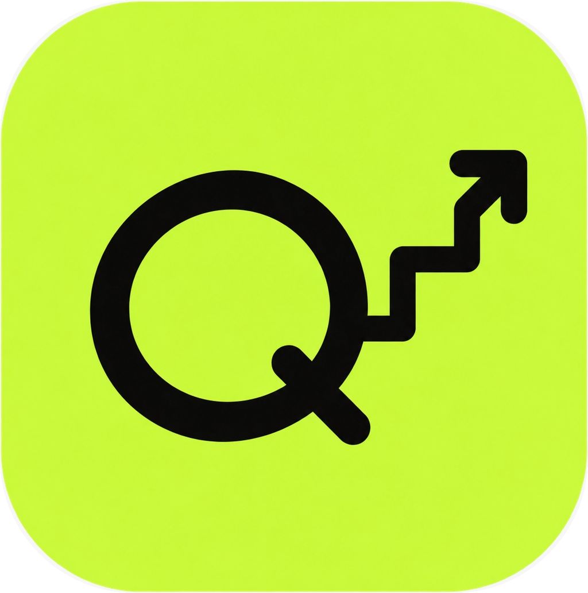
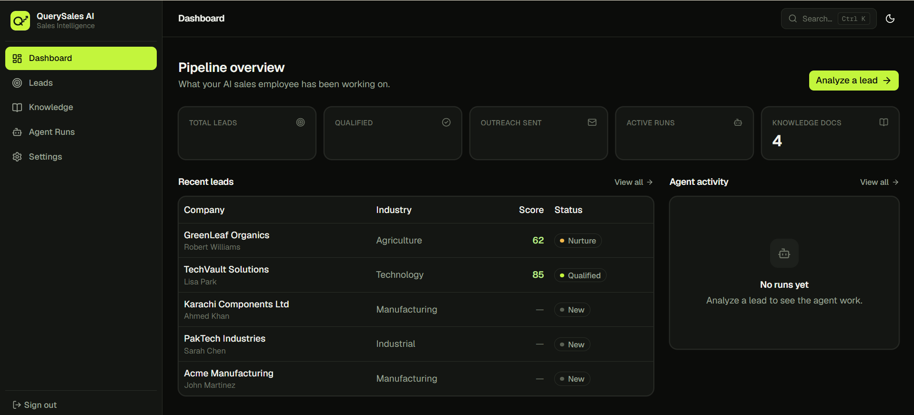
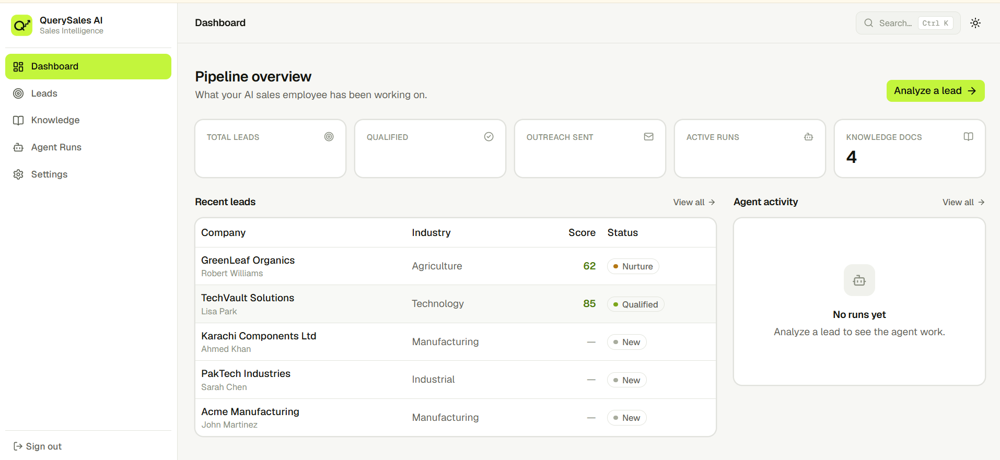
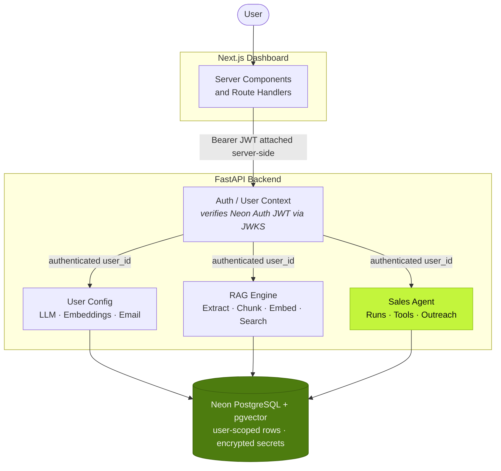

<a id="readme-top"></a>

<!-- PROJECT SHIELDS -->
[![Python][python-shield]][python-url]
[![FastAPI][fastapi-shield]][fastapi-url]
[![Next.js][nextjs-shield]][nextjs-url]
[![TypeScript][typescript-shield]][typescript-url]
[![Postgres][postgres-shield]][postgres-url]
[![pgvector][pgvector-shield]][pgvector-url]
[![OpenAI Agents SDK][agents-shield]][agents-url]
[![License][license-shield]](#license)

<!-- PROJECT LOGO -->
<br />
<div align="center">
  

  <h1 align="center">QuerySales AI</h1>

  <p align="center">
    An autonomous AI sales employee that reads your company knowledge, reasons about
    leads, plans sales actions, and executes them with real tools — showing you
    exactly what it did.
    <br />
    <br />
    <a href="#usage">View Demo</a>
    &middot;
    <a href="#getting-started">Get Started</a>
    &middot;
    <a href="#api-reference">API Reference</a>
    &middot;
    <a href="docs/IMPLEMENTATION_PLAN.md">Implementation Plan</a>
  </p>
</div>

<!-- TABLE OF CONTENTS -->
<details>
  <summary>Table of Contents</summary>

- [About The Project](#about-the-project)
  - [Screenshots](#screenshots)
  - [Key Features](#key-features)
  - [Built With](#built-with)
- [Architecture](#architecture)
- [Getting Started](#getting-started)
  - [Prerequisites](#prerequisites)
  - [Installation](#installation)
- [Usage](#usage)
- [API Reference](#api-reference)
- [Project Structure](#project-structure)
- [Security Model](#security-model)
- [Design System](#design-system)
- [Project Status](#project-status)
- [Roadmap](#roadmap)
- [Contributing](#contributing)
- [License](#license)
- [Acknowledgments](#acknowledgments)

</details>

---

## About The Project

Most "AI sales tools" are a single LLM call wrapped in a form. **QuerySales AI is an agent.**
It decides what it needs to know, retrieves it from your own document corpus with real vector
search, reasons about fit, plans an action, and then calls tools to carry that action out —
updating the CRM record and drafting outreach.

The full loop is visible, step by step, in the UI:

```text
Knowledge → RAG → Agent Reasoning → Planning → Tool Calling → Sales Action → Trace/Logs
```

Why this design:

* **Retrieval is a tool, not a preprocessing step.** The agent calls `search_knowledge(query)`
  when *it* decides it needs company knowledge — that is what makes the behaviour autonomous
  rather than scripted.
* **Every user is an island.** Leads, documents, vectors, agent runs and provider credentials
  are all scoped to the authenticated user. Vector search filters by `user_id` *inside* the SQL.
* **Bring your own model.** No hardcoded provider. Each user configures their own
  OpenAI-compatible LLM and embedding endpoints; keys are encrypted at rest with AES-256-GCM
  and never returned to the browser.

### Screenshots

<table>
  <tr>
    <td width="50%"></td>
    <td width="50%"></td>
  </tr>
  <tr>
    <td align="center"><em>Dashboard — dark</em></td>
    <td align="center"><em>Dashboard — light</em></td>
  </tr>
</table>

### Key Features

| | Feature | What it does |
|---|---|---|
| 🧠 | **Autonomous sales agent** | One agent, many tools. Runs an OBSERVE → RETRIEVE → REASON → PLAN → ACT → RESULT loop and decides its own tool calls. |
| 🔍 | **Real RAG over pgvector** | Upload `.md` / `.txt` / `.pdf`; the pipeline extracts, cleans, chunks, embeds and indexes into Postgres with a `vector(1536)` column and an IVFFlat cosine index. |
| 🛠️ | **Four agent tools** | `search_knowledge` · `get_lead` · `update_lead` · `draft_outreach`. Outreach is drafted, never auto-sent — a human approves. |
| 📊 | **Live analysis timeline** | Watch the agent work in real time. Each phase streams in as it happens; every tool call and knowledge query is expandable. |
| 🔐 | **Per-user everything** | LLM, embeddings, email, ERPNext, Google Places and Google Calendar — every credential configured from the UI, per account. AES-256-GCM at rest, key held outside the database. |
| 🎨 | **Polished dashboard** | Next.js 16 + shadcn/ui + Tailwind v4, dark and light themes, a ⌘K command palette, and sortable/filterable tables everywhere. |
| 🧾 | **Full audit trail** | Token counts, cost estimates, tool inputs/outputs and agent reasoning persisted per run. |

### Built With

**Backend**

[![Python][python-shield]][python-url]
[![FastAPI][fastapi-shield]][fastapi-url]
[![SQLAlchemy][sqlalchemy-shield]][sqlalchemy-url]
[![Postgres][postgres-shield]][postgres-url]
[![pgvector][pgvector-shield]][pgvector-url]
[![OpenAI Agents SDK][agents-shield]][agents-url]

**Frontend**

[![Next.js][nextjs-shield]][nextjs-url]
[![React][react-shield]][react-url]
[![TypeScript][typescript-shield]][typescript-url]
[![Tailwind CSS][tailwind-shield]][tailwind-url]
[![shadcn/ui][shadcn-shield]][shadcn-url]

<p align="right">(<a href="#readme-top">back to top</a>)</p>

---

## Architecture



**The browser never talks to FastAPI directly.** The session JWT lives in an httpOnly cookie;
Next.js server components and route handlers attach it as a Bearer token server-side. That
keeps the token out of browser JavaScript and gives one place to handle 401s.

### The agent loop

```mermaid
flowchart LR
    OBSERVE["OBSERVE<br/><i>understand the lead</i>"]
    RETRIEVE["RETRIEVE<br/><i>search_knowledge</i>"]
    REASON["REASON<br/><i>evaluate product fit</i>"]
    PLAN["PLAN<br/><i>decide the sales action</i>"]
    ACT["ACT<br/><i>update_lead · draft_outreach</i>"]
    RESULT["RESULT<br/><i>structured output + trace</i>"]
    COMPLETE(["COMPLETE"])

    OBSERVE --> RETRIEVE --> REASON --> PLAN --> ACT --> RESULT --> COMPLETE
    REASON -. "needs more evidence" .-> RETRIEVE

    classDef accent fill:#C3F53C,stroke:#8FBF14,stroke-width:1px,color:#0B0C0A
    class RETRIEVE,COMPLETE accent
```



The dotted edge is the point: **the agent decides when it needs knowledge.** Retrieval is a tool
it chooses to call, not a preprocessing step wired ahead of the model — and it can go back for
more before committing to a plan.

<p align="right">(<a href="#readme-top">back to top</a>)</p>

---

## Getting Started

### Prerequisites

| Requirement | Version | Notes |
|---|---|---|
| **Python** | 3.13+ | See `salesops-agent-backend/.python-version` |
| **Node.js** | 20+ | Next.js 16 requirement |
| **PostgreSQL** | 15+ with `pgvector` | [Neon][neon-url] recommended — it is what this project is tuned for |
| **Neon Auth** | — | Provides sign-in and JWKS verification |
| **An OpenAI-compatible LLM endpoint** | — | OpenAI, OpenRouter, Gemini's compatible endpoint, Qwen, … |
| **An OpenAI-compatible embeddings endpoint** | — | Must produce **1536-dimension** vectors |

> [!IMPORTANT]
> The embedding dimension is fixed at **1536** to match the `vector(1536)` column. Saving an
> embedding configuration with a different dimension is rejected with a clear error rather than
> silently re-shaping your vectors.

### Installation

1. **Clone the repository**

   ```sh
   git clone https://github.com/aurabextech-jpg/QuerySales-AI.git
   cd QuerySales-AI
   ```

2. **Enable pgvector on your database**

   ```sql
   CREATE EXTENSION IF NOT EXISTS vector;
   ```

3. **Generate an encryption key** — this protects every stored credential.

   ```sh
   python -c "import os,base64; print(base64.b64encode(os.urandom(32)).decode())"
   ```

   > [!WARNING]
   > Store `ENCRYPTION_KEY` outside the database and never commit it. **If you lose it, every
   > stored API key and token becomes unrecoverable.**

4. **Configure and start the backend**

   ```sh
   cd salesops-agent-backend
   cp .env.example .env          # then fill in the values below
   pip install -r requirements.txt
   alembic upgrade head
   uvicorn main:app --reload --port 8000
   ```

   Backend `.env`:

   | Variable | Required | Purpose |
   |---|:---:|---|
   | `DATABASE_URL` | ✅ | `postgresql+asyncpg://…` connection string |
   | `ENCRYPTION_KEY` | ✅ | Base64 32-byte key for AES-256-GCM |
   | `NEON_AUTH_URL` | ✅ | Neon Auth base URL |
   | `NEON_AUTH_JWKS_URL` | ✅ | JWKS endpoint for JWT verification |
   | `GOOGLE_SITE_VERIFICATION` | ○ | Meta tag for the public landing pages |

   > [!IMPORTANT]
   > **That is the whole file — there are no API keys in it.** LLM, embeddings,
   > email, ERPNext, Google Places and Google Calendar are all configured by
   > each user from **Settings**, stored AES-256-GCM encrypted against their
   > account, and resolved per request. The server holds no shared credential
   > and no fallback, so one user's keys can never be spent by another
   > (plan §54 Option A).

   API docs are then at **http://localhost:8000/docs**.

5. **Configure and start the frontend**

   ```sh
   cd ../querysales-web
   cp .env.example .env.local
   npm install
   npm run dev
   ```

   Frontend `.env.local`:

   | Variable | Purpose |
   |---|---|
   | `API_URL` | FastAPI base URL — **server-only**, never `NEXT_PUBLIC_*` |
   | `NEON_AUTH_URL` | Neon Auth base URL, used by the login route handler |

   The dashboard runs at **http://localhost:3000**.

6. **Seed demo data** so the dashboard does not open empty

   ```sh
   cd ../salesops-agent-backend
   python -m scripts.create_demo_user                 # creates a Neon Auth demo account
   python -m scripts.seed_demo                        # two users, leads, knowledge, real embeddings
   python -m scripts.seed_demo --skip-ingestion       # rows only, no embedding API calls
   ```

   Both scripts are idempotent — re-running them will not duplicate rows.

<p align="right">(<a href="#readme-top">back to top</a>)</p>

---

## Usage

### The demo flow

1. **Sign in** at `/login`.
2. **Open the dashboard** — KPI tiles, recent leads, and recent agent activity.
3. **Configure your providers** at `/settings` — LLM, embeddings, and email. Use
   **Test connection** on each; you only ever see success or failure, never the key.
4. **Upload knowledge** at `/knowledge`. Watch the status move
   `uploaded → extracting → chunking → embedding → indexed`.
5. **Open a lead** and hit **Analyze with QuerySales AI**.
6. **Watch the timeline** stream:

   ```text
   ✓ Lead loaded
   ✓ Understanding lead requirements
   ✓ Searching company knowledge
   ✓ Retrieved 4 relevant documents
   ✓ Evaluating product fit
   ✓ Creating sales action plan
   ✓ Updating lead
   ✓ Drafting personalized outreach
   ✓ Analysis complete
   ```

7. **Review the trace** at `/runs/[id]` — every phase expands to show the exact knowledge
   query, its source documents, tool arguments, and the outreach draft.
8. **Approve the outreach** to send it through your own configured SMTP.

### Structured agent output

Every completed run persists a result of this shape:

```json
{
  "lead_score": 93,
  "qualification": "Qualified",
  "reasoning": "Manufacturing lead with an explicit inventory-visibility pain point, matching two case studies in the knowledge base.",
  "pain_points": ["Inventory visibility", "Manual stock reconciliation"],
  "matched_knowledge": ["Manufacturing Solutions.md", "Inventory Management Case Study.md"],
  "recommended_action": "Send a personalized outreach referencing the Karachi Components rollout.",
  "outreach": {
    "subject": "Improving inventory visibility at Acme Manufacturing",
    "body": "…"
  }
}
```

`reasoning` is a concise business rationale — hidden chain-of-thought is never exposed.

### Keyboard shortcuts

| Shortcut | Action |
|---|---|
| <kbd>⌘</kbd> <kbd>K</kbd> / <kbd>Ctrl</kbd> <kbd>K</kbd> | Command palette — search leads and documents, navigate, switch theme |

<p align="right">(<a href="#readme-top">back to top</a>)</p>

---

## API Reference

All endpoints require a Neon Auth `Bearer` token and are scoped to the authenticated user.
Requesting another user's record returns **404**, never their data.

<details>
<summary><strong>Leads</strong></summary>

| Method | Endpoint | Description |
|---|---|---|
| `GET` | `/api/leads` | List leads — `?search=` `?status=` `?limit=` `?offset=` |
| `POST` | `/api/leads` | Create a lead |
| `GET` | `/api/leads/{id}` | Lead detail + its runs and outreach drafts |
| `PATCH` | `/api/leads/{id}` | Update a lead |
| `DELETE` | `/api/leads/{id}` | Delete a lead |
| `POST` | `/api/leads/{id}/analyze` | **Run the autonomous sales agent** |
| `POST` | `/api/leads/outreach/{draft_id}/approve` | Approve and send a draft |

</details>

<details>
<summary><strong>Knowledge & RAG</strong></summary>

| Method | Endpoint | Description |
|---|---|---|
| `GET` | `/api/knowledge` | List documents with chunk counts |
| `POST` | `/api/knowledge/upload` | Upload `.md` / `.txt` / `.pdf` (max 10 MB) |
| `POST` | `/api/knowledge/{id}/process` | Re-run the ingestion pipeline |
| `DELETE` | `/api/knowledge/{id}` | Delete a document and its chunks |
| `POST` | `/api/knowledge/search` | Vector similarity search — returns document, chunk, score, metadata |

</details>

<details>
<summary><strong>Agent runs</strong></summary>

| Method | Endpoint | Description |
|---|---|---|
| `GET` | `/api/runs` | List runs with lead, score and qualification |
| `GET` | `/api/runs/{id}` | Run detail including the structured result |
| `GET` | `/api/runs/{id}/events` | Phase events — `?after_sequence=N` for incremental polling |
| `GET` | `/api/workflows/{id}/logs` | Merged tool-call and audit trace timeline |

</details>

<details>
<summary><strong>Settings</strong></summary>

| Method | Endpoint | Description |
|---|---|---|
| `GET` `PUT` `DELETE` | `/api/settings/llm` | LLM provider configuration |
| `POST` | `/api/settings/llm/test` | Test the connection — returns success/failure only |
| `GET` `PUT` `DELETE` | `/api/settings/embedding` | Embedding provider (dimension fixed at 1536) |
| `POST` | `/api/settings/embedding/test` | Test the connection |
| `GET` `PUT` `DELETE` | `/api/settings/email` | SMTP / outreach configuration |
| `POST` | `/api/settings/email/test` | Connect and authenticate without sending |
| `GET` | `/api/settings/database` | Postgres and pgvector status — never the DSN |

</details>

<details>
<summary><strong>Integrations</strong></summary>

Third-party credentials are per user, AES-256-GCM encrypted, and configured
entirely from **Settings → Integrations**. The field set for each provider comes
from the backend registry (`core/integrations.py`), so the UI renders any
provider without a frontend change.

| Method | Endpoint | Description |
|---|---|---|
| `GET` | `/api/settings/integrations` | Every provider with this user's status and field schema |
| `GET` | `/api/settings/integrations/{provider}` | One provider's configuration |
| `PUT` | `/api/settings/integrations/{provider}` | Save it — an omitted secret keeps the stored value |
| `POST` | `/api/settings/integrations/{provider}/test` | Verify against the live provider; returns success/failure only |
| `DELETE` | `/api/settings/integrations/{provider}` | Remove the configuration |

Providers: `erpnext` · `google_places` · `google_calendar`.

</details>

<details>
<summary><strong>Dashboard & chat</strong></summary>

| Method | Endpoint | Description |
|---|---|---|
| `GET` | `/api/dashboard/stats` | KPI counts, recent leads, recent activity |
| `POST` | `/api/chat` | Conversational multi-agent orchestrator |
| `POST` | `/api/chat/stream` | Same, returning every agent and tool event |
| `GET` | `/api/chat/history` | Conversation history for a run |

</details>

> Secrets are **never** returned. Settings responses carry `{ "configured": true,
> "api_key_masked": "sk-••••1234" }` and nothing more.

<p align="right">(<a href="#readme-top">back to top</a>)</p>

---

## Project Structure

```text
QuerySales-AI/
├── salesops-agent-backend/       # FastAPI + OpenAI Agents SDK
│   ├── agent_core/
│   │   ├── sales_agent.py        #   the autonomous lead analyst
│   │   ├── sales_tools.py        #   search_knowledge · get_lead · update_lead · draft_outreach
│   │   ├── model_factory.py      #   per-user LLM client construction
│   │   ├── events.py             #   OBSERVE…COMPLETE phase emitter
│   │   ├── orchestrator.py       #   conversational multi-agent chat
│   │   └── tracing.py            #   SDK spans → Postgres audit trail
│   ├── services/knowledge/       # extract · chunk · embed · search · ingest
│   ├── api/endpoints/            # leads · knowledge · runs · settings · dashboard · chat
│   ├── core/                     # config · security (JWT) · crypto (AES-256-GCM) · user_config
│   ├── db/                       # SQLAlchemy models & async session
│   ├── mcp_tools/                # ERPNext · Gmail · Google Places · Calendar adapters
│   ├── alembic/                  # migrations
│   └── scripts/                  # seed_demo · create_demo_user
│
├── querysales-web/               # Next.js 16 dashboard
│   ├── app/(dashboard)/          #   dashboard · leads · knowledge · runs · settings
│   ├── app/api/                  #   BFF route handlers → FastAPI
│   ├── components/               #   agent · leads · runs · knowledge · ui (shadcn)
│   ├── hooks/use-data-table.ts   #   sort · search · facet filtering
│   └── lib/                      #   api-client (server-only) · auth · types · format
│
├── docs/
│   ├── IMPLEMENTATION_PLAN.md    # phase-by-phase build plan
│   ├── REUSE_MAP.md              # existing → reuse/adapt/build audit
│   └── summery/                  # one summary per completed phase
│
├── screenshots/
├── AGENTS.md                     # architecture, conventions, project memory
└── plan.md                       # original product specification
```

<p align="right">(<a href="#readme-top">back to top</a>)</p>

---

## Security Model

| Concern | How it is handled |
|---|---|
| **Credential storage** | AES-256-GCM via `cryptography`'s `AESGCM`, fresh 12-byte nonce per encryption. No custom cryptography. |
| **Key management** | `ENCRYPTION_KEY` comes from the environment and is never stored in Postgres. |
| **Secret exposure** | Settings responses return `configured` plus a masked hint. The plaintext never reaches the browser, a log line, or an agent trace. |
| **Data isolation** | Every user-owned table carries `user_id`. `user_id` is derived only from the verified JWT — never from a query param, path param, or request body. |
| **Vector isolation** | `WHERE c.user_id = :user_id` sits **inside** the similarity query, not applied after fetching. |
| **Session handling** | JWT in an httpOnly, secure, `SameSite=Lax` cookie. Attached server-side; unreadable from `document.cookie`. |
| **Upload safety** | Extension allowlist, 10 MB cap, and post-extraction emptiness checks — enforced on both client and server. |
| **Error handling** | Handlers log the real cause server-side with a correlation ID and return a generic message. Provider errors never leak hostnames or paths. |

<p align="right">(<a href="#readme-top">back to top</a>)</p>

---

## Design System

**Graphite & Signal Lime** — a restrained graphite canvas with a single high-voltage accent.

| Role | Dark | Light |
|---|---|---|
| Canvas | `#0B0C0A` | `#F7F7F4` |
| Surface | `#141613` | `#FFFFFF` |
| Border | `#2A2E27` | `#E2E4DC` |
| Text primary | `#F0F2EC` | `#14150F` |
| Data / score | `#B8E986` | `#4D7C0F` |
| **Signal Lime** (actions) | `#C3F53C` | `#C3F53C` |

Five rules keep it disciplined:

1. **Lime is for actions only** — primary button, active nav item, focus ring. Never headings,
   never scores, never links.
2. **One lime button per screen.** Everything else is outline or ghost.
3. **Status badges are never colour-filled** — a neutral outline pill with a 6px colour dot.
4. **Text on lime is always near-black** (`#0B0C0A`), never white.
5. **Borders 0.5px · card radius 12px · button radius 8px.**

Themes switch through CSS variables only. The brand palette is defined once and mapped onto
shadcn's token contract (`--primary`, `--background`, `--ring`, …), so every shadcn component
inherits the theme with no per-component overrides.

<p align="right">(<a href="#readme-top">back to top</a>)</p>

---

## Project Status

**Working MVP.** All eleven build phases are complete — see
[`docs/summery/`](docs/summery/) for a per-phase record of what was built and verified.

Known limitations, stated plainly:

* **Multi-user isolation was verified by code audit**, not by a live two-account test — every
  user-scoped query was reviewed and confirmed to filter by `user_id`, but no live cross-account
  test has been run.
* **The end-to-end demo needs a configured backend.** All code paths exist; the flow requires
  a reachable database and valid LLM plus embedding credentials.
* **Test coverage is partial and deliberately so.** A green suite does not mean a change is
  safe — verify affected flows manually.
* **The React Native app in `salesopsapp/` is frozen.** It is kept as a UI and API reference
  only and is not maintained.

<p align="right">(<a href="#readme-top">back to top</a>)</p>

---

## Roadmap

- [x] pgvector RAG pipeline with user-scoped similarity search
- [x] `search_knowledge` as a real agent tool
- [x] Per-user LLM / embedding / email configuration, encrypted at rest
- [x] Live agent-run timeline
- [x] Next.js dashboard with dark and light themes
- [ ] True event streaming (currently polled — Vercel's Python runtime buffers responses)
- [ ] Hybrid retrieval — pgvector combined with Postgres full-text search
- [ ] Gmail Drafts API alongside SMTP send
- [ ] Move the conversational chat orchestrator onto per-user configuration
- [ ] Improved PDF extraction quality
- [ ] Pipeline analytics and charts

See [open issues][issues-url] for the full list of proposals and known bugs.

<p align="right">(<a href="#readme-top">back to top</a>)</p>

---

## Contributing

Contributions make the open-source community an extraordinary place to learn and build.
Any contribution you make is **greatly appreciated**.

1. Fork the project
2. Create your feature branch (`git checkout -b feature/amazing-feature`)
3. Commit your changes (`git commit -m 'Add some amazing feature'`)
4. Push to the branch (`git push origin feature/amazing-feature`)
5. Open a pull request

Before you open a PR, please make sure these pass:

```sh
# Frontend — from querysales-web/
npx tsc --noEmit     # zero errors
npx eslint .         # zero errors
npm run build        # the authoritative type gate

# Backend — from salesops-agent-backend/
alembic upgrade head
python -c "from main import app; print(len(app.routes), 'routes')"
```

> `npm run build` catches page and route type errors that `tsc --noEmit` cannot see, because
> `tsc` does not include Next's generated `.next/types/**`. A clean typecheck does not mean the
> app compiles.

Please read [`AGENTS.md`](AGENTS.md) first — it is the authority on architecture, conventions
and the non-negotiable rules around user isolation and secret handling.

<p align="right">(<a href="#readme-top">back to top</a>)</p>

---

## License

Distributed under the MIT License. See `LICENSE` for more information.

<p align="right">(<a href="#readme-top">back to top</a>)</p>

---

## Acknowledgments

* [OpenAI Agents SDK](https://github.com/openai/openai-agents-python) — the agent runtime and tracing hooks
* [Neon](https://neon.tech) — serverless Postgres and authentication
* [pgvector](https://github.com/pgvector/pgvector) — vector similarity in Postgres
* [shadcn/ui](https://ui.shadcn.com) — the component foundation
* [Lucide](https://lucide.dev) — icon set
* [Sonner](https://sonner.emilkowal.ski) — toast notifications
* [cmdk](https://cmdk.paco.me) — the command palette primitive
* [Best-README-Template](https://github.com/othneildrew/best-readme-template) — this README's structure

<p align="right">(<a href="#readme-top">back to top</a>)</p>

<!-- MARKDOWN LINKS & IMAGES -->
[issues-url]: https://github.com/aurabextech-jpg/QuerySales-AI/issues
[license-shield]: https://img.shields.io/badge/License-MIT-C3F53C?style=for-the-badge
[python-shield]: https://img.shields.io/badge/Python-3.13+-3776AB?style=for-the-badge&logo=python&logoColor=white
[python-url]: https://python.org
[fastapi-shield]: https://img.shields.io/badge/FastAPI-0.136-009688?style=for-the-badge&logo=fastapi&logoColor=white
[fastapi-url]: https://fastapi.tiangolo.com
[sqlalchemy-shield]: https://img.shields.io/badge/SQLAlchemy-2.0-D71F00?style=for-the-badge&logo=sqlalchemy&logoColor=white
[sqlalchemy-url]: https://www.sqlalchemy.org
[nextjs-shield]: https://img.shields.io/badge/Next.js-16-000000?style=for-the-badge&logo=nextdotjs&logoColor=white
[nextjs-url]: https://nextjs.org
[react-shield]: https://img.shields.io/badge/React-19-61DAFB?style=for-the-badge&logo=react&logoColor=black
[react-url]: https://react.dev
[typescript-shield]: https://img.shields.io/badge/TypeScript-5-3178C6?style=for-the-badge&logo=typescript&logoColor=white
[typescript-url]: https://www.typescriptlang.org
[tailwind-shield]: https://img.shields.io/badge/Tailwind_CSS-4-06B6D4?style=for-the-badge&logo=tailwindcss&logoColor=white
[tailwind-url]: https://tailwindcss.com
[shadcn-shield]: https://img.shields.io/badge/shadcn%2Fui-latest-000000?style=for-the-badge&logo=shadcnui&logoColor=white
[shadcn-url]: https://ui.shadcn.com
[postgres-shield]: https://img.shields.io/badge/PostgreSQL-15+-4169E1?style=for-the-badge&logo=postgresql&logoColor=white
[postgres-url]: https://www.postgresql.org
[pgvector-shield]: https://img.shields.io/badge/pgvector-1536d-4169E1?style=for-the-badge&logo=postgresql&logoColor=white
[pgvector-url]: https://github.com/pgvector/pgvector
[agents-shield]: https://img.shields.io/badge/OpenAI_Agents-SDK-412991?style=for-the-badge&logo=openai&logoColor=white
[agents-url]: https://github.com/openai/openai-agents-python
[neon-url]: https://neon.tech
